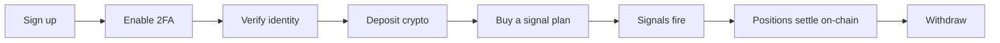

# Welcome to BlackQuant

BlackQuant is a **non-custodial execution platform for on-chain markets**. It watches liquidity across several chains, fires signals when a measurable edge appears, and settles every resulting trade on-chain where you can verify it yourself.

Non-custodial is the load-bearing word. BlackQuant is granted permission to execute specific routes on your behalf and is never granted permission to withdraw. Your keys stay yours for the entire lifetime of the account.


**New here?** The fastest path from nothing to a running account is five pages long: [Create an account](getting-started/create-an-account.md) → [Secure your account](getting-started/secure-your-account.md) → [Verify your identity](getting-started/verify-your-identity.md) → [Fund your account](getting-started/fund-your-account.md) → [Choose a signal plan](getting-started/choose-a-signal-plan.md).


## Where to go

| Section | What is in it |
| --- | --- |
| [**Introduction**](introduction/what-blackquant-is.md) | What the platform actually does, the vocabulary it uses, and who it suits. |
| [**Getting started**](getting-started/create-an-account.md) | Account creation through to a funded account with an active plan. |
| [**Using the platform**](platform/control-center.md) | Every screen in the dashboard, one page each. |
| [**Billing**](billing/plans-and-pricing.md) | Plans, add-ons and how crypto checkout settles. |
| [**Security**](security/custody-model.md) | The custody model, 2FA, recovery, and the published audits. |
| [**Developers**](developers/architecture.md) | Architecture, local setup, environment, API and webhooks. |

## The short version

Each step is a page in [Getting started](getting-started/create-an-account.md). Nothing in the chain is optional except the last one.

## What BlackQuant never does

These are structural guarantees, not policy promises — they follow from how the system is built, and the [custody model](security/custody-model.md) explains why.

* It never holds your private keys.
* It never has withdrawal permission on your wallet.
* It never places an order from the signal engine. The engine measures and publishes; it cannot move money. See [Signal Engine](platform/signal-engine.md).
* It never pays referral commission on a deposit — only on a purchase. See [Referral Hub](platform/referral-hub.md) for why that distinction matters.

## Status and transparency

* **Audits** — the full third-party reports are published unedited, with the scope each firm actually reviewed, at [Audit reports](security/audit-reports.md).
* **Uptime** — the public status page is published by an external monitor watching `/api/health`, deliberately hosted off this infrastructure.
* **Contracts** — the on-chain contracts are open source at [github.com/Blackquant-labs/blackquant-contract](https://github.com/Blackquant-labs/blackquant-contract).
* **Changelog** — every notable change is recorded in the [changelog](https://github.com/Blackquant-labs).


BlackQuant is trading infrastructure, not investment advice. Nothing in this documentation is a recommendation to buy or sell any asset, and no past measurement in the platform predicts a future one. Read [Reading the numbers honestly](platform/signal-engine.md#reading-the-numbers-honestly) before drawing conclusions from any win rate on the dashboard.

