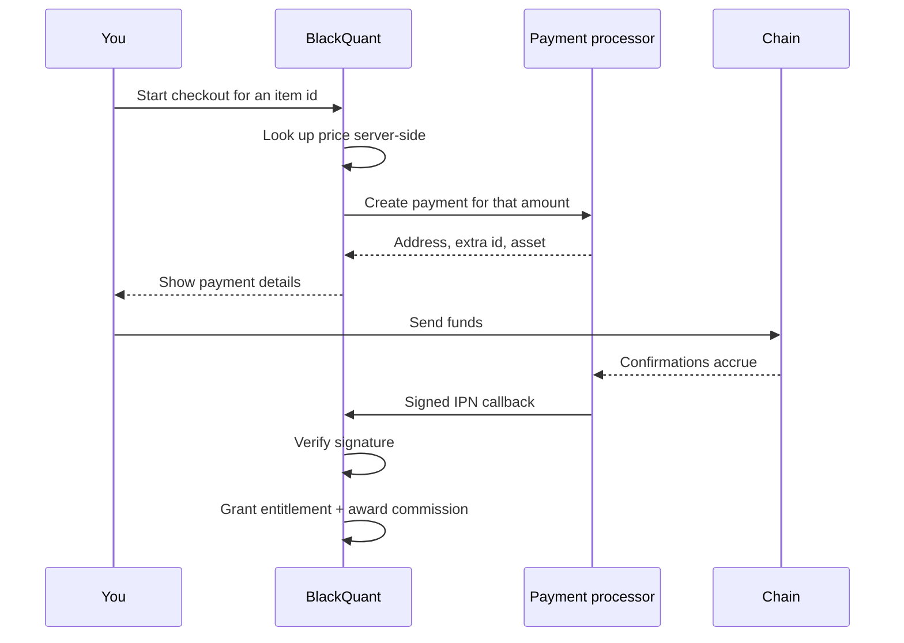

# Paying with crypto

There are two ways to pay for anything in the catalogue.

| Route | When to use it |
| --- | --- |
| **Account balance** | You already have a credited balance |
| **Crypto checkout** | Your balance is short, or you would rather pay per purchase |

## Balance

The simple case. Buying debits your account balance and grants the entitlement in the same database transaction — both happen or neither does.

If the balance is insufficient, the purchase is refused rather than partially applied.

## Crypto checkout

Checkout provisions a **payment intent**: an address for a chosen asset, tied to that specific purchase rather than to your account balance generally.

### Why this settles from a webhook

The purchase logic is deliberately written **without a session**. A click carries a signed-in user; a crypto checkout settles from a webhook where there is nobody to read.

Both routes must grant identically, and the webhook path must not have to load the authentication stack to do it. That is why the same code serves both.

## Fulfilment

A payment intent is marked fulfilled once, at settlement. The entitlement is granted at that moment — not when you send, and not when the first confirmation appears.


Confirmation thresholds are the same as for deposits and vary by asset, from 1 on the XRP Ledger to 32 on Solana. The full table is in [Fund your account](../getting-started/fund-your-account.md#supported-assets).


## The same warnings apply


**Network is fixed per asset.** A checkout address is issued for one asset on one network. Sending over a different chain is not recoverable.

**Extra ids matter.** Where a memo or destination tag is shown, a transfer without it cannot be attributed.


## Which to choose

**Fund the balance first** if you expect to buy more than once, or want a single ledger entry per deposit rather than one per purchase.

**Check out directly** for a one-off, or to avoid holding a balance on the platform at all.


Checking out directly rather than holding a balance is the more conservative choice, and there is no pricing penalty for it.


## If a checkout does not settle

1. Confirm the transaction reached the required confirmations on a block explorer.
2. Check the state on the deposit screen — the states and their handling are in [Troubleshooting](../resources/troubleshooting.md#deposit-states).
3. If it reads `PARTIALLY_PAID`, contact [Help Desk](../platform/knowledge-and-help.md) with the transaction hash.

A payment that settles after an intent has expired is still recorded — contact support rather than sending again.
