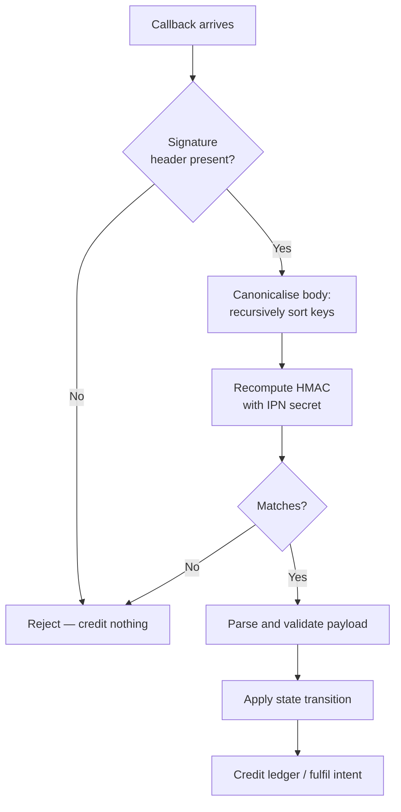

# Webhooks

## `POST /api/deposit/ipn`


**This is the only endpoint in the application where a balance increases.** Without its signature check it would be an unauthenticated "give this user money" endpoint. Nothing in it trusts the caller.


## Signature verification

The processor signs each callback. The application recomputes that signature over a **canonicalised** form of the body — keys sorted recursively — and compares.

Canonicalisation matters: JSON object key order is not guaranteed across serialisers, so signing the raw bytes as received would produce mismatches on semantically identical payloads.

## Why everything answers 200

Callbacks the application deliberately ignores still return **200**.

A non-200 makes the processor retry, and retrying a callback that was intentionally ignored generates noise without ever succeeding. A 200 means *received and handled*, not *credited*.

## State transitions

Deposits only ever move **forward**. A late or out-of-order callback carrying an earlier state cannot walk a deposit backwards from `CONFIRMED` to `CONFIRMING`.

| State | |
| --- | --- |
| `WAITING` | Address issued |
| `CONFIRMING` | Seen on-chain |
| `CONFIRMED` | Threshold reached — credited |
| `PARTIALLY_PAID` | Short amount |
| `FAILED` | Did not complete |
| `EXPIRED` | Window closed |

Each callback's raw payload is stored alongside the event, so a disputed deposit can be reconstructed from what actually arrived rather than from what was derived.

## Two things a callback can settle

**A deposit** → credits the balance with a ledger entry.

**A payment intent** → fulfils a crypto checkout: grants the entitlement and awards referral commission. This is why purchase logic takes a user id rather than a session — there is nobody signed in on this path.

## Operational notes

* **Idempotency** — a payment id is unique; a replayed callback does not double-credit.
* **Ordering** — not guaranteed; forward-only transitions handle it.
* **Retries** — expected. The handler must stay idempotent.
* **Latency** — crediting follows the callback, which can lag final on-chain confirmation slightly.

## Related

* [API reference](api-reference.md)
* [Fund your account](../getting-started/fund-your-account.md)
