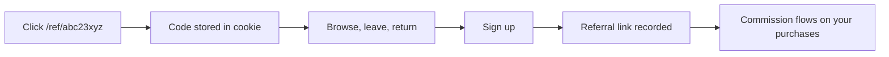

# Create an account

## Two ways in

### Email and password

Go to **Sign up**, provide your email address and choose a password. Your email is stored lowercased and trimmed, so `You@Example.com ` and `you@example.com` are the same account and you cannot accidentally create two.

### GitHub

If GitHub sign-in is enabled on the deployment, the OAuth button appears on both the sign-in and sign-up screens.


An account created through GitHub has **no password**. Signing in with email and password against that account will not work, and will fail identically to a wrong password rather than telling you the account exists — that is deliberate, so the login form cannot be used to discover which email addresses are registered.

To add a password later, use [Reset credentials](../security/account-recovery.md#changing-your-password).


## If you arrived from a referral link

A referral link looks like `/ref/<code>`. Visiting one stores the code in a cookie for **30 days**, then forwards you to the site.

That window is deliberate. Attribution that only survived a single navigation would credit almost nobody — the usual pattern is that someone reads the landing page, wanders off, and signs up several days later.

When you complete sign-up, the stored code is resolved to the referring account and the link is recorded permanently. It cannot be changed afterwards.

Referral codes are eight characters from an alphabet with `0`, `o`, `1`, `l` and `i` removed, because those get misread when typed off a screen.

## Choosing a password

There is no maximum length and no character-class requirement designed to be annoying. Length is what matters.

| Do | Don't |
| --- | --- |
| Use a password manager and a long random string | Reuse a password from another exchange or wallet service |
| Use a passphrase of several unrelated words | Use a variation of a password you use elsewhere |
| Store the recovery codes from 2FA setup separately | Keep 2FA codes in the same password manager entry as the password |

## What you get immediately

* An account with a **$0.00 balance**.
* A **referral code** of your own, usable straight away from the [Referral Hub](../platform/referral-hub.md).
* A welcome notification in the bell menu.
* Access to the dashboard, with the deposit and plan flows open.

## What is still gated

| Action | Requires |
| --- | --- |
| Deposit crypto | Nothing further |
| Buy a plan or add-on | A funded balance, or crypto checkout |
| Withdraw | [Identity verification](verify-your-identity.md) |
| Change password | Emailed reset code |

## Next

Do **not** skip straight to funding. Turn on two-factor authentication first — it takes about two minutes and it is much easier to do on an empty account than after you have a balance.

* [Secure your account](secure-your-account.md)
