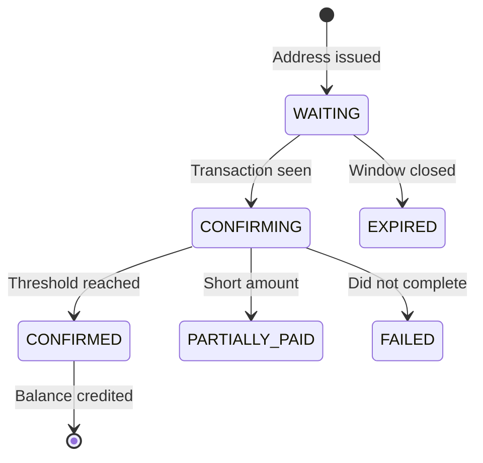
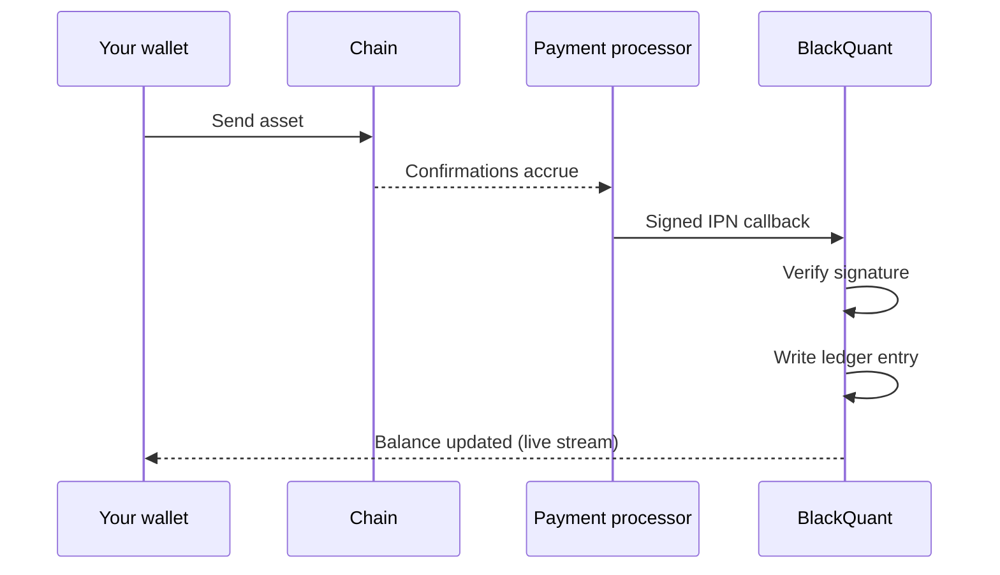

# Fund your account

Go to **Apps → Fund Account**.


**Read this before you send anything.**

Every asset below is tied to **one fixed network**. The network is not a setting you choose, because choosing it wrong is the single largest cause of permanent, unrecoverable loss on any deposit page — and a network picker invites exactly that mistake.

Send USDT over TRC-20 to the TRC-20 address. An address issued for one network cannot receive an asset bridged over another.


## Supported assets

| Asset | Network | Confirmations required | First confirmation |
| --- | --- | --- | --- |
| BTC | Bitcoin | 6 | ~10 min |
| ETH | ERC-20 (Ethereum) | 12 | ~1 min |
| USDT | TRC-20 (Tron) | 20 | ~1 min |
| BNB | BEP-20 (BNB Smart Chain) | 15 | ~5 sec |
| SOL | Solana | 32 | ~1 sec |
| XRP | XRP Ledger | 1 | ~5 sec |
| ADA | Cardano | 15 | ~20 sec |
| DOT | Polkadot | 2 | ~6 sec |

"First confirmation" is roughly how long until you see movement. Full crediting waits for the confirmation count in the column beside it.

## How to deposit

1. **Pick an asset.** The network is then fixed and displayed.
2. **Read the minimum.** Below it, network fees make the transfer uneconomic to credit.
3. **Copy the address.** Use the copy button rather than transcribing it.
4. **Check for an extra id.** Some assets require a memo / destination tag. If one is shown, a transfer sent without it cannot be attributed to your account.
5. **Send from your wallet** on the displayed network.
6. **Watch the status update.** The page streams changes live — you do not need to refresh.

## Deposit states

| State | What it means | What to do |
| --- | --- | --- |
| `WAITING` | Address issued, nothing on-chain yet | Send, or wait for your wallet to broadcast |
| `CONFIRMING` | Seen on-chain, confirmations accruing | Wait |
| `CONFIRMED` | Credited to your balance | Nothing |
| `PARTIALLY_PAID` | Less arrived than expected | Contact [Help Desk](../platform/knowledge-and-help.md) with the transaction hash |
| `FAILED` | Transfer did not complete | Check your wallet; funds normally never left |
| `EXPIRED` | Address window closed before funds arrived | Request a new address; do **not** reuse the old one |

## How crediting works

When the network reaches the confirmation threshold, the payment processor sends a **signed callback**. The platform verifies that signature before touching any balance — an unsigned or mis-signed callback credits nothing.

Crediting then writes a **ledger entry**, and your balance is derived from the ledger. That is why every movement in your balance has a row explaining it, visible under [Treasury](../platform/treasury.md).

## Common mistakes

* **Wrong network.** Covered above, and worth repeating: it is not recoverable.
* **Missing memo / extra id.** Where required, this is what attributes the transfer to you.
* **Sending below the minimum.** The transfer arrives but is uneconomic to credit.
* **Reusing an expired address.** Request a fresh one.

## Next

* [Choose a signal plan](choose-a-signal-plan.md)
