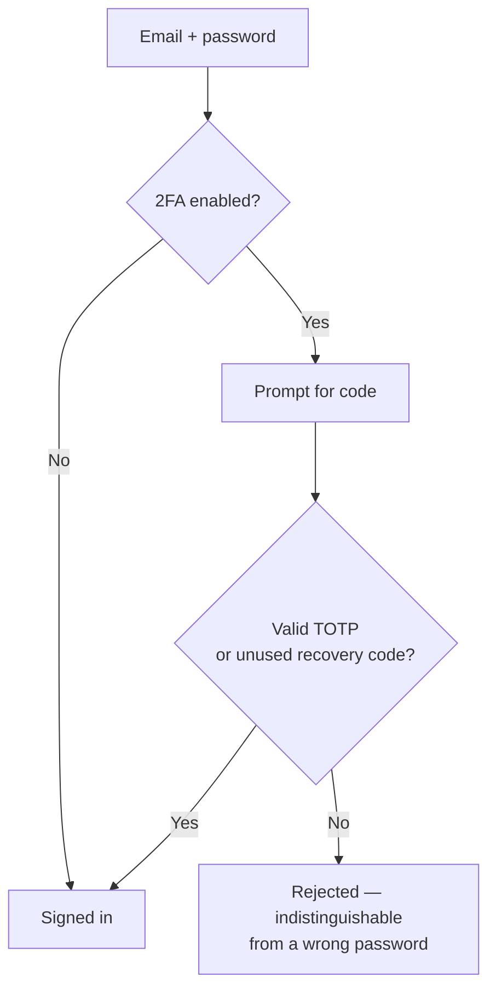

# Secure your account

Do this before you deposit anything. Two minutes now; a much worse afternoon later if you skip it.

## Enable two-factor authentication

Go to **Personal → 2FA / Auth Guard** in the dashboard sidebar.

### 1. Begin enrolment

The platform generates a secret and shows it as a QR code plus a text fallback. The secret is encrypted at rest with a key derived from the deployment's signing secret — it is never stored in plain text.

### 2. Scan it with an authenticator app

Any TOTP app works: 1Password, Bitwarden, Aegis, Raivo, Google Authenticator, Authy.

### 3. Confirm with a code

Enter the current six-digit code. Enrolment is only completed once a code verifies, so a mis-scanned QR cannot lock you out — if it does not verify, nothing has changed and you can start again.


Codes are accepted with **one step of clock skew** either side, so a phone whose clock is up to thirty seconds out still works. If codes are consistently rejected, your device clock is probably wrong by more than that — enable automatic time sync.


### 4. Save your recovery codes

You are shown **ten single-use recovery codes**. Each one authenticates once, in place of your authenticator app.


This is the only time the codes are shown. Store them somewhere you can reach **without** your phone and **without** your password manager, if that manager is on the same phone. A printed copy in a drawer is not an unreasonable answer.


Spending a recovery code marks it used in the same database statement that selects it. That is what stops the same code authenticating twice from two simultaneous attempts.

## After it is on

Every sign-in asks for a code. The second factor is enforced at the authentication layer itself, not only in the sign-in form — so a caller that invokes the sign-in path directly still cannot skip it.

## Regenerating recovery codes

**2FA / Auth Guard → Regenerate recovery codes** issues a fresh set of ten and invalidates every previous code. Do this if you have used several, or if you suspect a stored copy has been seen.

## Turning it off

Disabling 2FA requires a valid code first — so someone with only your password cannot remove it. Turning it off invalidates all outstanding recovery codes.

## Session length

| Choice at sign-in | Session lasts |
| --- | --- |
| "Remember me for 30 days" ticked | 30 days |
| Unticked | 24 hours |

The session cookie is always issued with the longer lifetime; the shorter one is enforced by a timestamp inside the token itself. A JWT cannot expire when your browser closes, so the unticked option means one day rather than "until I close the tab".

## Recommended baseline

* [x] 2FA enabled
* [x] Recovery codes stored offline, separately from your password
* [x] A unique password not used on any other exchange or wallet service
* [x] "Remember me" left **unticked** on shared or public machines

## Next

* [Verify your identity](verify-your-identity.md) — required before you can withdraw.
