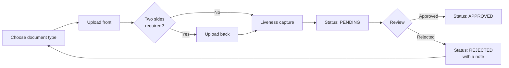

# Verify your identity

Identity verification is required before you can withdraw. Everything else on the platform works without it.

Go to **Personal → Verification**.

## Accepted documents

| Document | Sides required |
| --- | --- |
| Passport | 1 — photo page only |
| Driver's licence | 2 — front and back |
| National ID card | 2 — front and back |

## Photo requirements

All four must hold, or the submission is rejected on review:

* Document must be **valid and not expired**
* **All four corners** must be visible
* Text must be **clearly legible**
* **No glare, shadows or obstructions**

### File limits

| | |
| --- | --- |
| Formats | JPEG, PNG, WebP |
| Maximum size | 8 MB per image |


8 MB is deliberately modest. These are photographs of a document, not archival scans — a phone camera shot at default settings lands well inside it. If yours does not, your camera is set to something unusual.


## The liveness step

After the document images, you are asked for a **liveness capture** — a selfie, taken in the moment, to check that the person submitting the document is the person in it.

## Submission flow

## Statuses

| Status | Meaning |
| --- | --- |
| `PENDING` | Submitted, awaiting review |
| `APPROVED` | Verified — withdrawals unlocked |
| `REJECTED` | Not accepted; a review note explains why |

A rejection is not final. Read the note, fix the specific problem, and submit again. The overwhelming majority of rejections are glare on a laminated card or a cropped corner.

## Where your documents are stored

Documents go to **private object storage** — never a public directory, and never the application database.

They are readable only by the review process, and are not served over any public URL.

## Privacy

* Documents are used for verification and are not shared with other users.
* You can export everything the platform holds on you from **My Profile → Export account data**.
* Account deletion is available from **My Profile**, and cascades to submissions and documents.

## Next

* [Fund your account](fund-your-account.md)
