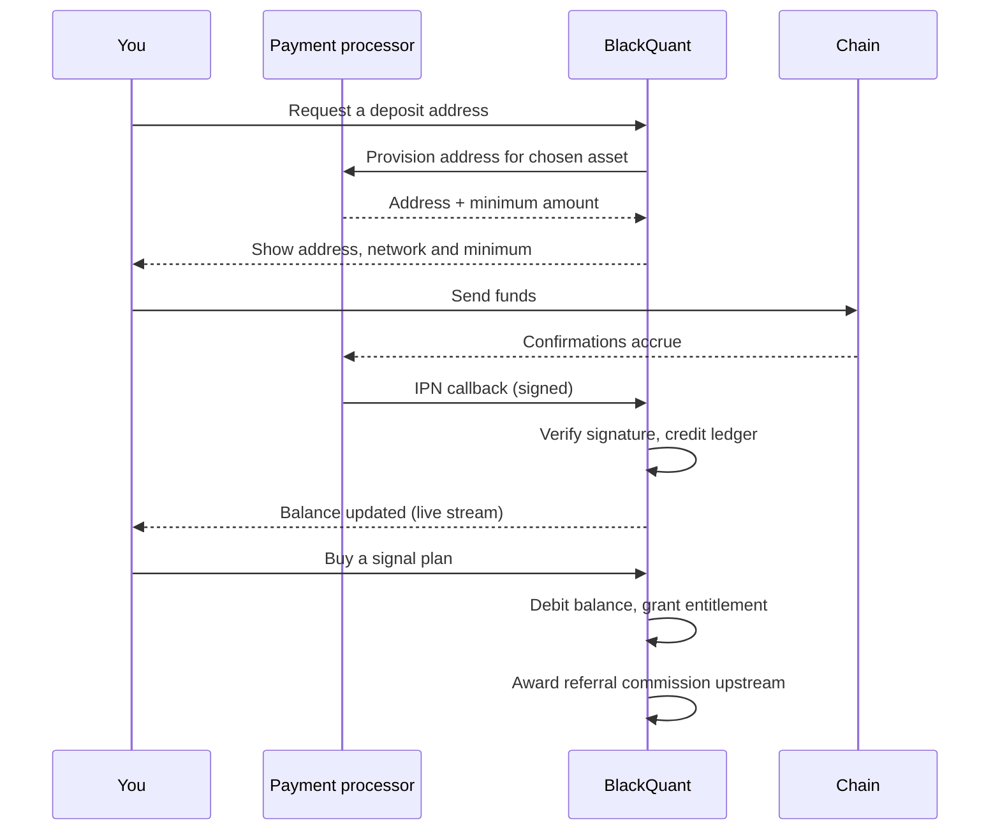

# How it works

This page follows a single dollar through the system. Every step links to the page that covers it in full.

## The full path

## Step by step

### 1. Money arrives

You pick an asset on [Fund your account](../getting-started/fund-your-account.md). The platform provisions a deposit address for that specific asset **on a fixed network** — the network is not a choice you make.


**Sending an asset over the wrong chain is the single largest cause of permanent loss on any deposit page.** BlackQuant fixes the network per asset rather than offering a picker, precisely to remove that failure mode. Send USDT on TRC-20 to a TRC-20 address; never assume an address works across chains.


### 2. Confirmations accrue

Each asset has its own confirmation threshold before a deposit is credited — from 1 on the XRP Ledger to 32 on Solana. The full table is in [Fund your account](../getting-started/fund-your-account.md#supported-assets).

Your deposit moves through states: `WAITING` → `CONFIRMING` → `CONFIRMED`. It can also land on `PARTIALLY_PAID`, `FAILED` or `EXPIRED`. Each state and what to do about it is in [Troubleshooting](../resources/troubleshooting.md#deposit-states).

### 3. The callback is verified, then credited

The payment processor calls back over a signed IPN webhook. The platform verifies the signature before touching any balance — an unsigned or mis-signed callback credits nothing. See [Webhooks](../developers/webhooks.md).

Crediting writes a **ledger entry**, not just a new balance number. The balance is derived from the ledger, so every movement has a row explaining it.

### 4. You buy an entitlement

A [signal plan](../billing/plans-and-pricing.md) is a subscription with a fixed term — 30 days for monthly, 365 for annual. An [add-on](../billing/add-ons.md) has no expiry and is owned permanently once bought.

The price is looked up **server-side from the item id**. The browser sends an id, never an amount, so nobody can name their own price.

### 5. Referral commission is awarded — on the purchase

If you were referred, commission flows up the chain at the moment of purchase: **5% to your direct referrer (Tier 1), 2% to theirs (Tier 2)**.


Commission is paid on purchases and **never on deposits**. A deposit is still your own money and can be withdrawn again, so paying a percentage of one out is both a straight loss and a laundering route. A purchase is revenue the business has actually earned. See [Referral Hub](../platform/referral-hub.md).


### 6. Signals fire, positions settle

With an active plan, the [Signal Engine](../platform/signal-engine.md) screen carries the live feed and the measured statistics for each strategy. Positions that result are listed in [Positions](../platform/positions.md), and settle on-chain where you can verify them independently of anything this dashboard tells you.

### 7. You withdraw

[Withdrawals](../platform/withdrawals.md) covers requesting a payout, the checks applied, and what identity verification is required first.

## What happens live, and what does not

| Surface | Update mechanism |
| --- | --- |
| Deposit status | Server-sent event stream (`/api/deposit/stream`) — updates without a refresh |
| Signal engine feed | Server-sent event stream (`/api/signal-engine/stream`) |
| Balance | Re-read on navigation and on deposit events |
| Positions | Re-read on navigation |
| Plan entitlement | Evaluated per request against the expiry timestamp |

## Next

* [Key concepts](key-concepts.md) — the vocabulary.
* [Create an account](../getting-started/create-an-account.md) — start the actual flow.
