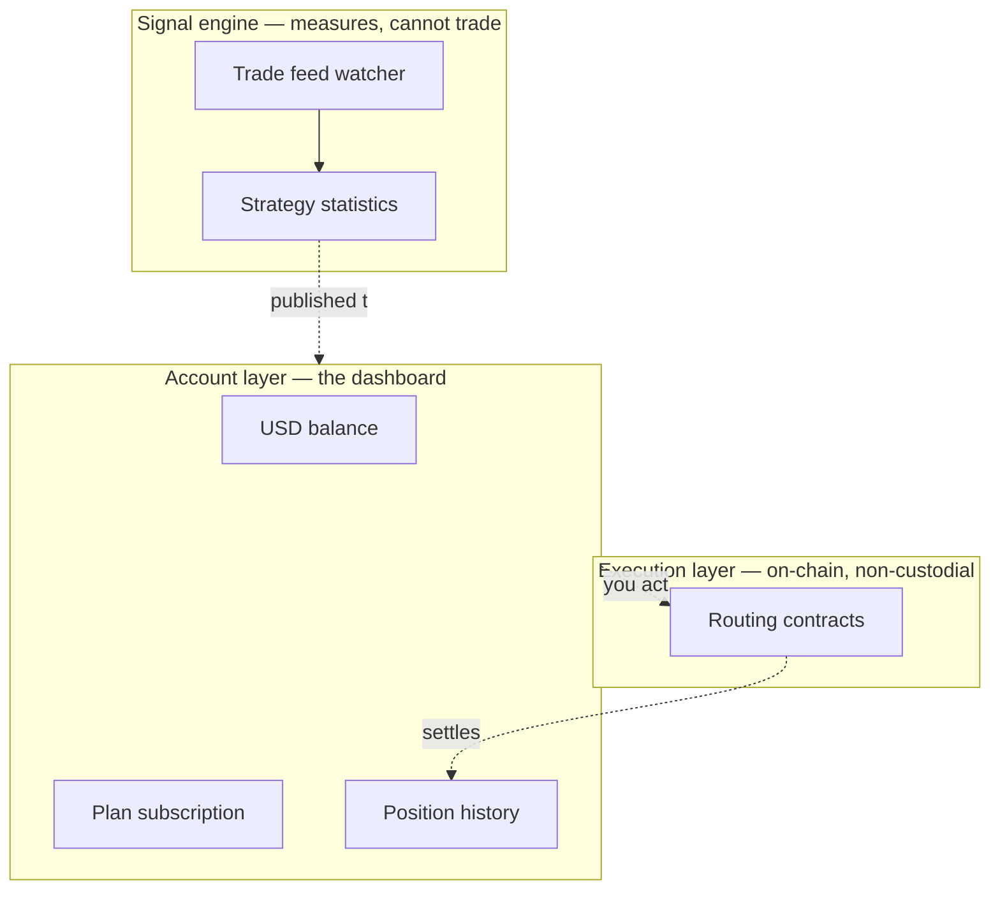

# What BlackQuant is

BlackQuant is execution infrastructure. It does three separable things, and it helps to keep them separate in your head because they fail independently and are priced independently.

## The three parts

### 1. The signal engine

A process that watches the on-chain trade feed, fires a signal when a measurable inefficiency appears, and then — this is the unusual part — **measures what that signal was actually worth afterwards**.

The engine publishes win rates only once something has resolved. Before that it publishes `null`, not zero. "Not measured yet" and "measured at 0%" are different claims and only one of them is an indictment of a strategy, so the platform refuses to collapse them into the same number.

Every rate the engine publishes carries a **90% credible interval**, because 3 wins out of 4 and 300 out of 400 are both "75%" and only one is worth acting on.


**The engine cannot place orders.** Nothing reachable from the signal engine API can move money. It is a measurement and publication system, structurally separated from execution.


### 2. The execution layer

The on-chain contracts that route a trade once you have acted on a signal. These are the audited, open-source part: [github.com/Blackquant-labs/blackquant-contract](https://github.com/Blackquant-labs/blackquant-contract).

Execution is non-custodial. The contracts are granted permission to execute specific routes and are never granted permission to withdraw. See [The custody model](../security/custody-model.md).

### 3. The account layer

Everything in the dashboard: your USD balance, deposits, plan subscription, positions, referrals, identity verification and security settings. This is the part that looks like a normal web application, because it is one.

The dotted lines matter. The engine *publishes to* the dashboard; it does not instruct the contracts. You are the step in between.

## What it is not

**It is not a custodial exchange.** There is no BlackQuant wallet holding your assets that you withdraw from. Your USD balance in the dashboard is an account balance for buying plans and add-ons — it is not your trading capital, and it is not held against your keys.

**It is not a managed fund.** Nobody at BlackQuant trades on your behalf with discretion. The engine publishes measurements; acting on them is yours.

**It is not a signal group.** The distinguishing feature is the measurement discipline — published intervals, `null` for unmeasured, and on-chain settlement you can verify independently. A signal without a measured outcome attached is not a product this platform ships.

## The honest limitations

* **The engine measures the past.** Every statistic on the platform is backward-looking. A 90% credible interval quantifies sampling uncertainty, not regime change.
* **Audits are snapshots.** The published reports cover specific commits over fixed windows. See [Audit reports](../security/audit-reports.md) for what each one actually covered.
* **Latency is infrastructure, not magic.** The edge available to any participant decays as more participants have the same infrastructure.

## Next

* [How it works](how-it-works.md) — the end-to-end flow, step by step.
* [Key concepts](key-concepts.md) — the vocabulary used throughout these docs.
