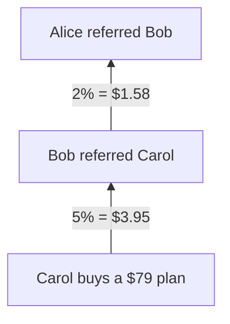
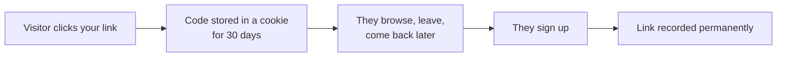

# Referral Hub

**Apps → Referral Hub.** Your link, your downstream, and what you have earned.

## The commission structure

Two tiers, paid in **basis points** of the purchase price.

| Tier | Who earns | Rate |
| --- | --- | --- |
| Tier 1 | Your direct referrer | **5%** (500 bps) |
| Tier 2 | Their referrer | **2%** (200 bps) |

Commission is funded by the business. It is not deducted from what the buyer pays.


Rates are stored as basis points rather than floats because 5% of $29 has to be an exact decimal, and `0.05 * 29` in floating point is not. Every amount in the ledger is a fixed-precision decimal for the same reason.


## Commission is paid on purchases, never on deposits

This is the single most important rule of the programme, and it is deliberate.


**A deposit is still the depositor's own money.** They can withdraw it again. Paying a percentage of a deposit out as commission would therefore be a straight loss to the business — and a laundering route, since it converts a self-funded round trip into a payout.

**A purchase is revenue the business has actually earned.** That is what commission is a share of.


The consequence: recruiting someone who deposits $100,000 and never buys anything earns you nothing. Recruiting someone who buys a $29 plan earns you $1.45.

## Your referral code

An **eight-character code** from an alphabet with `0`, `o`, `1`, `l` and `i` removed — those characters get misread when someone types them off a screen, and each misread is a support ticket.

Your link is `/ref/<your-code>`.

## How attribution works

The **30-day cookie** is what makes the programme work. The usual pattern is that someone reads the site, thinks about it, and signs up several days later — attribution that only survived one navigation would credit almost nobody.

Once recorded at sign-up, the link is permanent and cannot be reassigned.

## What is on the screen

| Block | Shows |
| --- | --- |
| Your link | Code and shareable URL, with a copy button |
| Summary | Referral count and total earned |
| Referrals list | Everyone you referred, filterable by **All / Active / Inactive** |
| Share row | Prepared links for common channels |

## Getting paid

Commission is credited to your **account balance** as a ledger entry at the moment the downstream purchase settles. It behaves like any other credit from there: spendable on plans and add-ons, or withdrawable subject to [verification](../getting-started/verify-your-identity.md).

## Notifications

Referral notifications default to **off**, because a referrer with a large downstream would otherwise be notified on every purchase beneath them. Turn them on in **Personal → My Profile**.

## Rules

* You cannot refer yourself.
* The link is set at sign-up and never changes.
* Commission is calculated on the **purchase price**, not on a discounted or partial amount.
* Both tiers are paid from the same purchase — they are not alternatives.

## Related

* [Plans and pricing](../billing/plans-and-pricing.md) — what your downstream can buy
* [Treasury](treasury.md) — where commission lands
