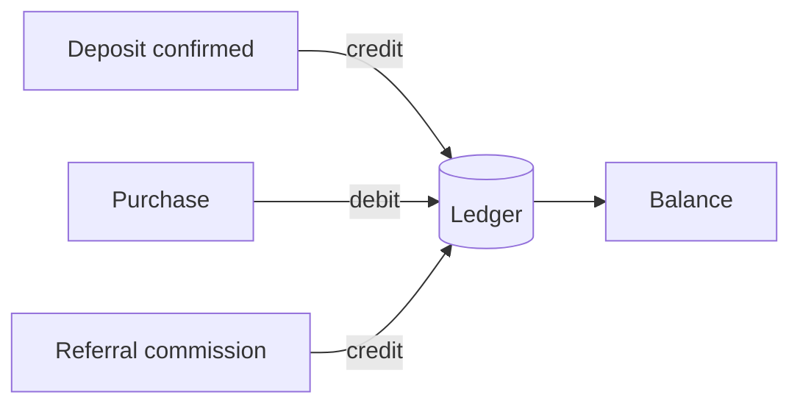

# Treasury

**Apps → Treasury.** The full picture of your account balance and the ledger it is derived from.

## Balance is derived, not stored

This is the most important thing to understand about the screen.

Your balance is not a counter that gets incremented. It is the sum of your **ledger entries** — one immutable row per movement, each carrying an amount, a `kind` explaining why, and a reference id pointing at whatever caused it.

The consequence is that you can always ask *why* a balance is what it is, and get an answer that reconciles. A balance stored as a single number cannot answer that question.

## What is on the screen

| Block | Shows |
| --- | --- |
| Stat cards | Current balance and headline movement figures |
| Balance history | The balance over time |
| Holdings | Breakdown of what makes up the balance |
| Allocation | How the balance is distributed |
| Transactions | Every ledger entry, newest first |

## Reading the transactions list

Each row is one ledger entry. The `kind` tells you what caused it:

| Movement | Direction |
| --- | --- |
| Deposit credited | **+** |
| Plan or add-on purchase | **−** |
| Referral commission earned | **+** |

Amounts are stored as exact decimals, never floats. This matters more than it sounds: commission of 5% on a $29 purchase has to be an exact figure, and `0.05 * 29` in floating point is not one. Rates are held in basis points and amounts in fixed-precision decimals throughout.

## Reconciling against the chain

A deposit's ledger entry references the deposit event, which carries the transaction hash. You can take that hash to a block explorer and confirm independently that what the platform says arrived is what actually arrived.


This is the intended workflow, not a power-user trick. The platform is built on the assumption you will verify rather than trust, and every credit is traceable to something on-chain.


## Common questions

**My deposit confirmed but the balance has not moved.**
Crediting happens when the signed callback is verified, which can lag the final on-chain confirmation slightly. If it persists, see [Troubleshooting](../resources/troubleshooting.md#deposit-states).

**A commission appeared that I did not expect.**
Someone below you in the referral chain bought something. Tier 1 pays 5%, Tier 2 pays 2%. See [Referral Hub](referral-hub.md).

**Can I convert my balance back to crypto?**
Via [Withdrawals](withdrawals.md), subject to identity verification.

## Related

* [Fund your account](../getting-started/fund-your-account.md)
* [Withdrawals](withdrawals.md)
* [Plans and pricing](../billing/plans-and-pricing.md)
