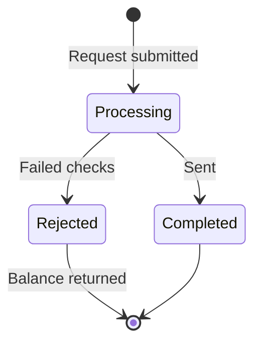

# Withdrawals

**Apps → Withdrawals.**


**Identity verification is required before you can withdraw.** If you have not completed it, do that first — [Verify your identity](../getting-started/verify-your-identity.md). It is much easier to discover this requirement with a small balance than a large one.


## Methods

| Method | Typical time |
| --- | --- |
| Bank transfer | 1–3 business days |
| USDT (TRC-20) | ~10 minutes |
| USDT (BEP-20) | ~5 minutes |


**The network is part of the address.** A USDT withdrawal to a TRC-20 address must be sent over TRC-20. Providing a BEP-20 address and selecting TRC-20 sends funds to an address that does not exist on that chain, and it is not recoverable.

Copy the receiving address from your wallet rather than typing it, and confirm the network in your wallet matches the method you selected here.


## Requesting one

1. Choose a **method**.
2. Enter an **amount** — it cannot exceed your available balance.
3. Provide the **destination**: a bank account for a transfer, or a wallet address for crypto.
4. Submit. The request enters processing.

## Request states

| Status | Meaning |
| --- | --- |
| **Processing** | Received and being reviewed |
| **Completed** | Sent — for crypto, a transaction hash is available |
| **Rejected** | Not processed; the reason is shown on the row |

A rejected request returns the amount to your balance. It does not disappear.

## History

The withdrawals screen keeps a full history with a reference (`WD-xxxx`), date, amount, method, masked destination and status. Filter by **All**, **Completed** or **Pending**.

The monthly chart above it shows withdrawal volume per month, which is a faster way to spot an unexpected month than reading the table.

## Common reasons a request is rejected

| Reason | Fix |
| --- | --- |
| Identity not verified | Complete [verification](../getting-started/verify-your-identity.md) |
| Address / network mismatch | Re-submit with an address on the selected network |
| Amount exceeds available balance | Check [Treasury](treasury.md) for pending debits |
| Bank details do not match the verified name | Withdraw to an account in your own name |

## Before your first large withdrawal

Run the whole loop once with a small amount. Deposit, buy something, withdraw. The first time through surfaces the verification requirement, the address format your wallet expects, and how long your chosen method actually takes — all of which are better learned at $50 than at $50,000.

## Related

* [Treasury](treasury.md) — where the balance comes from
* [Verify your identity](../getting-started/verify-your-identity.md) — the prerequisite
