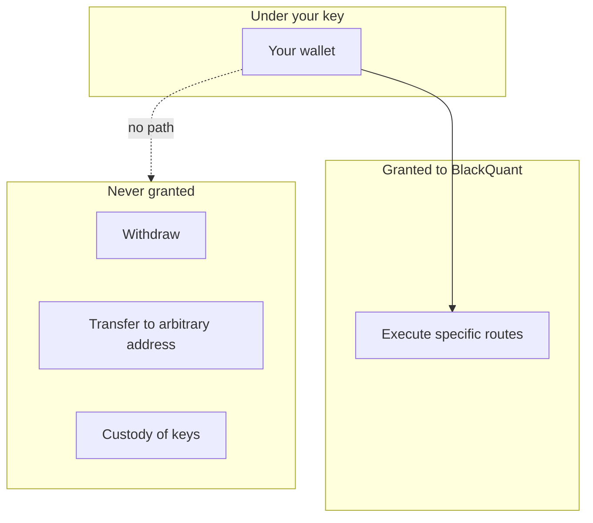

# The custody model

"Non-custodial" is used loosely across the industry. Here is precisely what it means on this platform, including the parts that are inconvenient.

## The guarantee

**BlackQuant is granted permission to execute specific routes. It is never granted permission to withdraw.**

Those are different permissions at the contract level, not a policy distinction. The execution contracts can route a trade you initiated; there is no code path by which they can move your assets to an address you did not specify.

## What follows from it

**Nobody at BlackQuant can move your funds.** Not support, not an administrator, not a compromised internal account.

**A platform compromise does not become a loss of your assets.** An attacker who fully owned BlackQuant's servers would have your account data — which is serious — but not the ability to withdraw your holdings.

**You do not need to trust the dashboard's numbers.** Everything settles on-chain, so the platform's claims are independently checkable. See [Positions](../platform/positions.md#verifying-on-chain).

## What it costs you

This is the part usually left out.


**Losing your keys means losing access, permanently.** There is no recovery path. No support ticket restores them, because the same property that stops BlackQuant moving your funds stops it helping you move them.

This is the direct cost of the guarantee. It is not a gap to be fixed later — a platform that could recover your keys is a platform that could take your funds.


**You are responsible for network selection.** Sending an asset over the wrong chain is unrecoverable, and no amount of platform-side care changes that. It is why the deposit page fixes the network per asset instead of offering a picker.

**You are responsible for the decision to trade.** Nobody exercises discretion on your behalf.

## Where the account balance fits

Your **USD account balance** is a different thing from your trading capital, and it is important not to conflate them.

| | Account balance | Trading capital |
| --- | --- | --- |
| What it is | USD credit for buying plans and add-ons | Assets under your own key |
| Held by | BlackQuant, as a ledger balance | You |
| Non-custodial | **No** — it is a balance on the platform | Yes |
| Recoverable by support | Yes | No |


The account balance **is** custodial in the ordinary sense. It exists so you can buy things without a checkout every time. Keep only what you need for that there, and withdraw the rest.


## The signal engine cannot trade

Worth stating separately because it is a structural separation, not a configuration.

The signal engine watches the trade feed, measures outcomes and publishes statistics. **No API it exposes can place an order.** A compromise of the engine yields bad data, which is bad — but it does not yield movement of funds.

## Verifying any of this

Do not take it on faith. The contracts are open source:



And the third-party reviews are published in full at [Audit reports](audit-reports.md) — including, explicitly, what each one did and did not cover.

## Related

* [Two-factor authentication](two-factor-authentication.md)
* [Audit reports](audit-reports.md)
