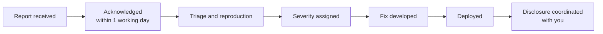

# Reporting a vulnerability

Report security issues to **security@blackquant.io**.


**Good-faith research is welcome.** Reports are acknowledged within one working day, and no legal action is taken against research conducted within the guidelines below.


## What to include

| | Why it matters |
| --- | --- |
| A clear description of the issue | What the actual defect is |
| Reproduction steps | The single most valuable part of a report |
| Impact | What an attacker gains — be concrete |
| Affected component | URL, endpoint, contract address or page |
| Supporting evidence | Screenshots, request/response pairs, transaction hashes |

A report that reproduces gets triaged in hours. One that describes a suspicion gets triaged in days.

## In scope

* The web application and its API
* The on-chain contracts at [Blackquant-labs/blackquant-contract](https://github.com/Blackquant-labs/blackquant-contract)
* Authentication, session handling and 2FA
* The deposit and IPN webhook path
* Anything that lets one account read or affect another's data

## Out of scope

* Findings from automated scanners with no demonstrated impact
* Missing headers or cookie flags with no exploit path
* Social engineering of staff or users
* Physical attacks
* Denial of service, volumetric or otherwise
* Vulnerabilities in third-party services not operated by BlackQuant
* Reports about the marketing site's content or copy

## Guidelines

**Do**

* Test only against accounts you control
* Stop as soon as you have confirmed a vulnerability
* Give reasonable time to fix before publishing

**Do not**

* Access, modify or destroy another user's data
* Degrade the service for other users
* Attempt to extract data beyond what is needed to demonstrate the issue

## What happens next

## Severity

| Severity | Examples |
| --- | --- |
| **Critical** | Unauthorised movement of funds; full authentication bypass |
| **High** | Access to another account's data; privilege escalation |
| **Medium** | Authentication weakness needing user interaction; sensitive data exposure |
| **Low** | Issues with limited impact or requiring improbable preconditions |

## Please do not


**Do not post a working exploit publicly before a fix is deployed.** The platform handles money, and a published exploit against a live financial system puts users at direct risk. Coordinate the timing — it will not be unreasonable.


## Related

* [Audit reports](audit-reports.md) — published third-party reviews
* [The custody model](custody-model.md) — the boundaries a compromise cannot cross
