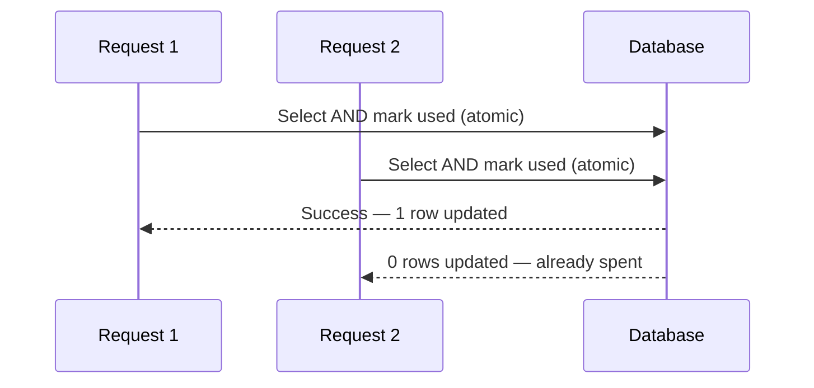

# Two-factor authentication

Setup instructions are in [Secure your account](../getting-started/secure-your-account.md). This page covers how it works and why.

## What is used

**TOTP** — time-based one-time passwords, the six-digit rotating codes. Any standard authenticator app works.

## Where the secret lives

Your TOTP secret is **encrypted at rest** using AES-256-GCM with a key derived from the deployment's signing secret via HKDF.


**Operators, note the trade-off.** Deriving the key from the signing secret means 2FA needs no separate configuration — but it also means **rotating that secret makes every stored TOTP secret undecryptable**.

Enrolled users must then fall back to a recovery code and re-enrol. Since rotating the signing secret already invalidates every session, this is not a routine operation. See [Environment variables](../developers/environment-variables.md).


An undecryptable secret is handled as a state, not an error — it returns null rather than throwing, and authentication falls through to recovery codes. Nobody is hard-locked out by a rotation.

## Clock skew

Codes are accepted with **one step of tolerance** either side of the current window. A device clock up to roughly thirty seconds out still works.

Consistent rejection almost always means a device clock that is wrong by more than that. Enable automatic time synchronisation.

## Recovery codes

**Ten single-use codes**, issued at enrolment and shown once.

### The concurrency detail

Spending a recovery code marks it used **in the same database statement that selects it**.

That is what stops the same code authenticating twice from two simultaneous attempts. A naive implementation that reads, checks and then writes has a window between the check and the write where a second request can use the same code.

### Regenerating

**2FA / Auth Guard → Regenerate recovery codes** issues ten fresh codes and invalidates every previous one. Do this after using several, or if a stored copy may have been seen.

## Enforcement

The second factor is enforced at the **authentication layer**, not only in the sign-in form. A caller invoking the sign-in path directly still cannot skip it.

## Failure modes are indistinguishable

A wrong password, a wrong 2FA code, a spent recovery code and an account that has no password (because it was created via GitHub) all fail **identically**.


This is deliberate. Distinct error messages would turn the sign-in form into an oracle for discovering which email addresses have accounts, whether they use OAuth, and whether 2FA is enabled. The cost is slightly worse ergonomics when you genuinely mistype; the benefit is that the form leaks nothing.


## Disabling

Requires a valid code first, so someone holding only your password cannot remove it. Disabling invalidates all outstanding recovery codes.

## Sessions

| "Remember me" | Session lifetime |
| --- | --- |
| Ticked | 30 days |
| Unticked | 24 hours |

The cookie always carries the longer lifetime; the shorter one is enforced by a timestamp inside the token. A JWT cannot expire when a browser closes, so "unticked" means one day rather than "until I close the tab" — leave it unticked on shared machines and sign out explicitly.

## Related

* [Account recovery](account-recovery.md)
* [Secure your account](../getting-started/secure-your-account.md)
